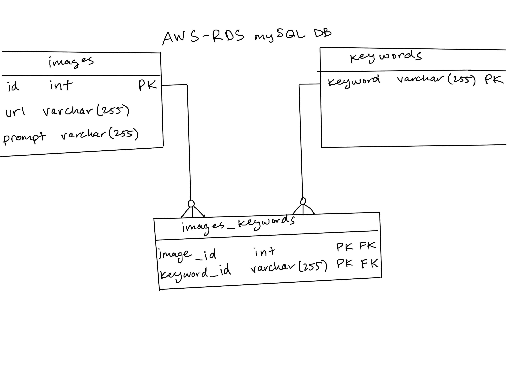

# Optica

## Backend

There are two major processes happening on the backend:

1. Querying for images. In order to load non-redundant data, a page number is expected. The mySQL database returns an array of URLs sorted by most recently added.
   One route accounts for a supplied keyword, the other does not. These URLs are endpoints that supply the image via the S3 bucket.

2. Uploading images. An image blob is sent to the backend, where it is uploaded to an S3 bucket. The bucket returns the endpoint (a URL) where the image is stored.
   This URL is added to the database, along with the keywords given at the time of image creation. NOTE: While the backend fully supports uploading images, the functionality
   was not implemented on the frontend.

### Database

Effectively storing and retrieving image data merits two separate databases: one for easily storing/querying relational data and one for managing the image files.

#### AWS RDS mySQL

This database holds all relational data. The url attribute refers to the URL where the data is stored on the AWS server.

#### AWS S3 Bucket

This database holds the actual image files. Images are accessed using an Object URL.

### Future Development Ideas

0. Refactor the "projectX" name to "Optica."
1. Support single/multi-keyword queries.
2. Create a relational database with a date attribute and do the querying by that attribute. Currently we are querying by id (which does work based on how our id attribute, but
   it's likely not best practice.)
3. The error handling for pretty much every step of the way needs serious thought and refactoring. There are some actually interesting error handling problems in imageController.js.
4. Refactor the images table to use the URL as the primary key. There's no real need for an ID, as you want the URLs to be unique.

## Frontend

Everything is currently built out with functional React and Hooks -BUT- RTK is a dependency, and the scaffolding for RTK is all there. Theoretically this could be refactored to use RTK.

### Componenets

This is rough diagram of the tree structure of the React App

                            index.html
                               |
                            index.js
                               |
                            App.jsx
                               |
                        mainPageContainer.js
                  /            |            \

searchComponent.js imageUploadComponent galleryContainer.js
|
imageComponent.js

- the heavy lifting of the app is happening in the galleryContainer

## querying db

- images are fetched via an axios get request to the DB at the endpoint of /images with a request parameter of a number.
- the req param equates to a page number.
- image urls a served from a database as arrays of 16 image urls at a time (1 page).

## some ideas for iteration

- send form data from search query to backend
- integrate RTK for state management
- integrate image upload component

## Image Conversion Flow

- input type="file"
- convert to buffer array
- JSON.string and send to server
- server converts to Mongodb Buffer, type 0
- post to Mongodb as buffer type
-
